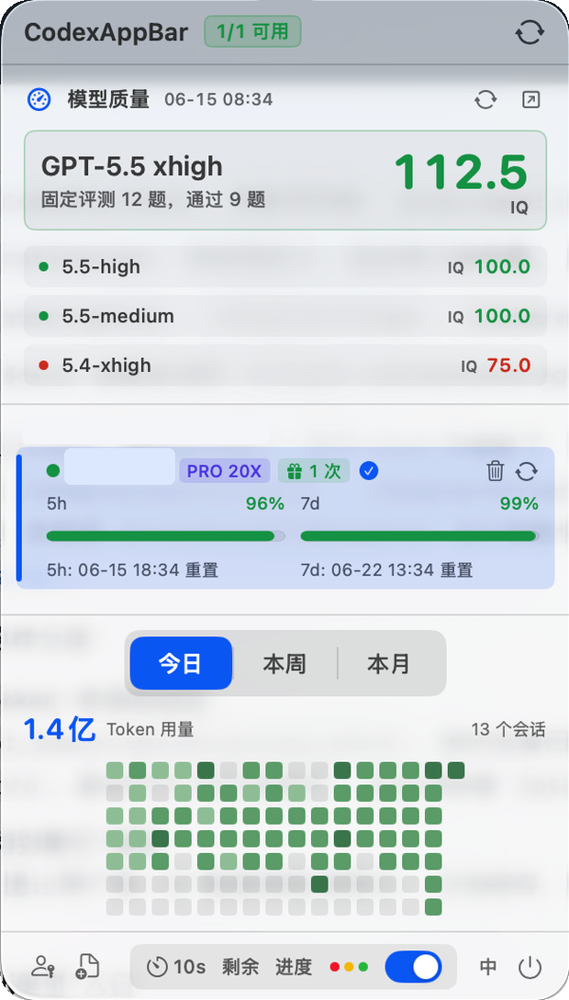
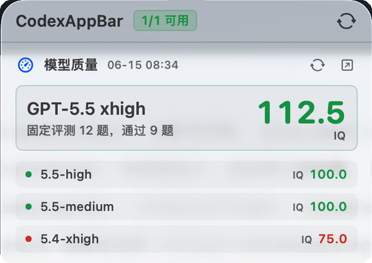

# CodexAppBar

CodexAppBar 是一个 macOS 菜单栏里的 Codex 状态中心：管理多个 ChatGPT/Codex 账号、查看 5h / 7d 额度、跟踪 Codex 会话状态、同步模型质量和本地 Token 用量。

<p>
  <a href="https://github.com/iamzjt-front-end/codexbar/releases/latest">Download latest release</a>
  ·
  <a href="#english-summary">English summary</a>
</p>



> 截图里的账号信息已经打码。项目会读写本机 `~/.codex` 下的 Codex 配置和统计文件，请先理解下方的工作原理与风险说明。

## 现在能做什么

- **多账号管理**：通过 OAuth 添加账号，也可以导入外部账号 JSON；同一个邮箱下的 Team / Workspace 会按组织分组展示。
- **一眼看额度**：同时展示 Codex 的 5h 滚动额度和 7d 周额度，支持已用 / 剩余口径切换。
- **状态栏常驻监控**：菜单栏胶囊可显示百分比数字或双进度条，并用图标提示正常、临近耗尽、额度耗尽、账号停用等状态。
- **Codex 会话红绿灯**：安装 hooks 后，菜单栏能提示 Codex 当前是 ready、running、需要处理权限，还是离线 / 状态过期。
- **模型质量**：接入 CodexRadar，直接在弹窗里看当前 Codex 模型 IQ 分数、通过题数和榜单对比。
- **邀请重置次数**：显示官方 banked Codex rate-limit reset 次数，方便判断紧急时还能不能救场。
- **Token 用量统计**：只读查询 Codex 本地 SQLite，显示今日 / 本周 / 本月 Token 总量、会话数和近 16 周热力图。
- **一键全局刷新**：右上角刷新会同时更新账号 token、Codex 额度、模型质量和 Token 统计。
- **更安全的账号切换**：可以只写入账号而不退出 Codex，也可以选择切换并重启 Codex 立即生效。
- **中英文界面**：弹窗底部可在中文和英文之间切换。

## 截图

| 完整弹窗 | 模型质量模块 |
| --- | --- |
|  |  |

## 安装

### 直接安装

1. 打开 [Releases](https://github.com/iamzjt-front-end/codexbar/releases/latest) 下载最新 `codexAppBar-*.zip`。
2. 解压后把 `codexAppBar.app` 放到 `Applications`。
3. 第一次启动如果被 macOS 拦截，可以在 Finder 里右键打开，或到系统设置里允许打开。
4. 启动后，CodexAppBar 会出现在菜单栏。

### 本地构建

当前工程目标版本：

- macOS 15.6+
- Xcode 16+ 或更新版本
- 本机已安装 Codex desktop app

```sh
git clone https://github.com/iamzjt-front-end/codexbar.git
cd codexbar
open codexBar.xcodeproj
```

在 Xcode 中选择开发者团队后运行，或者使用脚本：

```sh
scripts/restart-local.sh
```

常用参数：

```sh
scripts/restart-local.sh --config Debug
scripts/restart-local.sh --build-only
scripts/restart-local.sh --run-only
scripts/restart-local.sh --clean
```

## 使用方式

1. 点击菜单栏中的 CodexAppBar。
2. 点左下角钥匙图标授权账号，或用导入按钮导入账号 JSON。
3. 如果顶部提示需要安装 hooks，点击安装，并在 Codex 后续提示时选择信任。
4. 使用底部控制区调整刷新频率、额度口径、状态栏展示方式和红绿灯显示。
5. 需要切换账号时，点击对应账号的“切换”：
   - **仅切换**：只写入 `~/.codex/auth.json`，不中断正在运行的 Codex 任务，等 Codex 下次重读配置后生效。
   - **切换并重启 Codex**：写入账号并强制重启 Codex，立即生效，但会中断正在运行的任务。

## 底部控制区

- `10s / 30s / 1m / 2m`：切换弹窗可见时和后台的额度刷新频率，默认 30s。
- `已用 / 剩余`：控制状态栏和弹窗里的额度数字、进度条展示口径；告警颜色仍按真实已用比例计算。
- `数字 / 进度`：控制菜单栏胶囊显示百分比文本还是双进度条。
- 红绿灯开关：控制菜单栏是否显示 Codex 会话状态灯。
- `中 / EN`：切换界面语言。

## 工作原理

CodexAppBar 不依赖自建服务，数据主要来自本机文件和 OpenAI / Codex 相关接口：

- 账号池保存在 `~/.codex/token_pool.json`。
- 激活账号会写入 `~/.codex/auth.json`，供 Codex CLI / desktop app 读取。
- 额度来自 `https://chatgpt.com/backend-api/wham/usage`。
- 账号组织名来自 `https://chatgpt.com/backend-api/accounts/check/v4-2023-04-27`。
- 模型质量来自 `https://codexradar.com/current.json`。
- Token 用量只读查询 `~/.codex/sqlite/state_5.sqlite` 或 `~/.codex/state_5.sqlite`。
- hooks 安装会备份并合并写入 `~/.codex/hooks.json`，hook 脚本放在稳定路径 `~/.codex/codexbar/codexbar-session-status-hook.py`。
- hooks 写出的会话状态文件位于 `~/.codex/codexbar/session_status.json`。

## 发布

项目内置交互式发布脚本，会选择 tag、生成 release notes、archive、ad-hoc 签名、打包 zip，并通过 GitHub CLI 创建 Release：

```sh
scripts/release.sh
```

常用参数：

```sh
scripts/release.sh --yes
scripts/release.sh --tag v2026.06.15
scripts/release.sh --notes-file ./release-notes.md
scripts/release.sh --dry-run
scripts/release.sh --allow-dirty
```

发布前请确认：

- `gh auth status` 已登录目标仓库。
- tracked 文件没有未提交改动，除非你明确使用 `--allow-dirty`。
- tag 和 GitHub Release 不存在同名版本。

## 风险说明

这个项目与 OpenAI 无关联，也没有得到 OpenAI 官方认可。它使用了 Codex / ChatGPT 的本地文件结构和非公开接口，这些接口或文件格式可能随时变化。

请特别注意：

- 账号切换会修改 `~/.codex/auth.json`。
- hooks 安装会修改 `~/.codex/hooks.json`，虽然会先备份已有文件。
- 强制重启 Codex 会中断正在运行的任务。
- OAuth token 只应保存在你自己的机器上，不要把 `token_pool.json`、`auth.json` 或导出的账号 JSON 提交到仓库或分享给他人。

## English Summary

CodexAppBar is a macOS menu bar companion for Codex users. It manages multiple ChatGPT/Codex accounts, shows 5h and 7d quota usage, tracks live Codex session status through hooks, displays CodexRadar model-quality data, and reads local Codex token statistics.

Download the latest build from [GitHub Releases](https://github.com/iamzjt-front-end/codexbar/releases/latest), or build `codexBar.xcodeproj` locally with Xcode. The app is unofficial and uses local Codex files plus internal ChatGPT/Codex endpoints, so use it at your own risk.

## License

[MIT](LICENSE)
