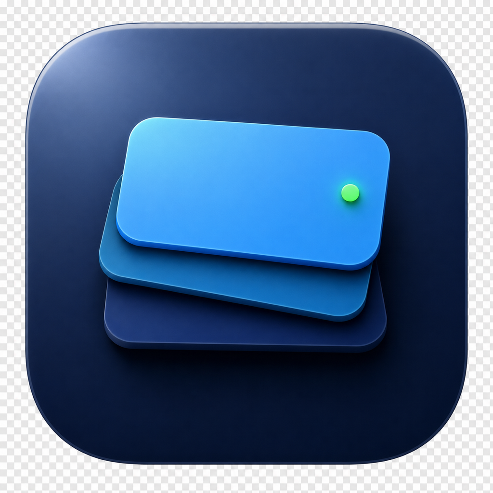

<p align="center">
  
</p>

<h1 align="center">CodexAppBar</h1>

<p align="center">
  Codex 用户的 macOS 菜单栏状态中心。
  <br>
  管理账号、监控额度、查看模型质量，并让本地 Codex 用量保持可见。
</p>

<p align="center">
  <a href="https://github.com/iamzjt-front-end/codexbar/releases/latest">
    
  </a>
  <a href="https://github.com/iamzjt-front-end/codexbar/stargazers">
    
  </a>
  <a href="https://github.com/iamzjt-front-end/codexbar/blob/main/LICENSE">
    
  </a>
  
</p>

<p align="center">
  <a href="README.md">简体中文</a>
  ·
  <a href="README_EN.md">English</a>
</p>

<p align="center">
  <a href="https://github.com/iamzjt-front-end/codexbar/releases/latest">下载</a>
  ·
  <a href="#功能特性">功能特性</a>
  ·
  <a href="#安装">安装</a>
  ·
  <a href="#工作原理">工作原理</a>
  ·
  <a href="#star-history">Star History</a>
</p>

> [!IMPORTANT]
> CodexAppBar 不是 OpenAI 官方项目。它会读取本机 Codex 文件，并使用部分 ChatGPT / Codex 相关的非公开接口，这些接口和文件格式都可能随时变化。

## 中文

CodexAppBar 是一个面向 Codex 用户的 macOS 菜单栏工具。它把多账号管理、额度监控、Codex 会话状态、模型质量和本地 Token 用量放到一个轻量弹窗里，适合需要频繁观察账号状态或切换账号的 Codex 用户。

## 截图

<p align="center">
  
</p>

## 功能特性

| 模块 | 说明 |
| --- | --- |
| 多账号管理 | 通过 OAuth 添加 ChatGPT/Codex 账号，支持导入外部账号 JSON，并按组织聚合 Team / Workspace 账号。 |
| 额度监控 | 同时展示 Codex 5h 滚动额度和 7d 周额度，包含重置时间，并支持“已用 / 剩余”口径切换。 |
| 菜单栏状态 | 在 macOS 菜单栏常驻展示额度数字或双进度条，并用颜色提示账号健康状态。 |
| Codex 会话红绿灯 | 安装 hooks 后，可显示 Codex 当前是 ready、running、等待权限、离线还是状态过期。 |
| 模型质量 | 接入 [codexradar.com](https://codexradar.com/)，展示 Model IQ、通过题数和模型对比结果。 |
| 邀请重置次数 | 当账号返回 banked reset 数据时，展示可用的 Codex rate-limit reset 次数。 |
| 本地 Token 统计 | 只读查询 Codex 本地 SQLite，展示今日 / 本周 / 本月 Token 用量、会话数和近 16 周热力图。 |
| 一键全局刷新 | 右上角刷新会同时更新账号 token、额度、模型质量和本地 Token 统计。 |
| 安全切换账号 | 支持“仅切换账号”和“切换并重启 Codex”两种模式，避免无意中断正在运行的任务。 |
| 中英文界面 | 弹窗 UI 可在中文和英文之间切换。 |

## 安装

从 [GitHub Releases](https://github.com/iamzjt-front-end/codexbar/releases/latest) 下载最新版本。

1. 下载 `codexAppBar-*.zip`。
2. 解压后将 `codexAppBar.app` 移动到 `Applications`。
3. 启动应用，它会出现在 macOS 菜单栏。
4. 如果首次启动被 macOS 拦截，可以在 Finder 中右键选择“打开”，或到系统设置中允许打开。

## 系统要求

- macOS 15.6 或更高版本
- 本机已安装 Codex desktop app
- 需要网络访问 ChatGPT / Codex 相关接口以获取额度和账号信息
- 可选：启用 Codex hooks 后可以显示会话状态红绿灯

## 本地构建

```sh
git clone https://github.com/iamzjt-front-end/codexbar.git
cd codexbar
open codexBar.xcodeproj
```

在 Xcode 中构建并运行 `codexBar` scheme，或者使用本地重启脚本：

```sh
scripts/restart-local.sh
```

常用参数：

```sh
scripts/restart-local.sh --config Debug
scripts/restart-local.sh --build-only
scripts/restart-local.sh --run-only
scripts/restart-local.sh --clean
```

## 使用方式

1. 从 macOS 菜单栏打开 CodexAppBar。
2. 通过 OAuth 添加账号，或导入已导出的账号 JSON。
3. 如果需要菜单栏红绿灯状态，按提示安装 hooks。
4. 在底部控制区调整刷新间隔、额度口径、菜单栏展示方式、红绿灯开关和语言。
5. 切换账号时按需要选择：
   - 仅切换：只更新 `~/.codex/auth.json`，不重启 Codex。
   - 切换并重启：更新账号并立即重启 Codex，使新账号马上生效。

## 工作原理

CodexAppBar 不依赖自建后端，数据来自本机 Codex 文件和 OpenAI / Codex 相关接口。

| 数据 | 来源 |
| --- | --- |
| 账号池 | `~/.codex/token_pool.json` |
| 当前激活账号 | `~/.codex/auth.json` |
| 额度用量 | `https://chatgpt.com/backend-api/wham/usage` |
| 账号 / 组织信息 | `https://chatgpt.com/backend-api/accounts/check/v4-2023-04-27` |
| 模型质量 | `https://codexradar.com/current.json` |
| 本地 Token 用量 | `~/.codex/sqlite/state_5.sqlite` 或 `~/.codex/state_5.sqlite` |
| hooks 配置 | `~/.codex/hooks.json` |
| 会话状态 hook | `~/.codex/codexbar/codexbar-session-status-hook.py` |
| 会话状态输出 | `~/.codex/codexbar/session_status.json` |

## 隐私与安全

CodexAppBar 尽量在本机完成工作，但它会接触敏感的 Codex 登录状态。

- OAuth token 和账号导出文件只应保存在你自己的机器上。
- 不要提交或分享 `token_pool.json`、`auth.json` 或导出的账号 JSON。
- 账号切换会写入 `~/.codex/auth.json`。
- hooks 安装会备份并更新 `~/.codex/hooks.json`。
- 重启 Codex 可能中断正在运行的任务。
- 非公开接口和本地文件格式可能随时变化。

## 发布

仓库内置发布脚本，可生成 release notes、archive、ad-hoc 签名、打包 zip，并通过 GitHub CLI 发布。

```sh
scripts/release.sh
```

常用参数：

```sh
scripts/release.sh --yes
scripts/release.sh --tag v2026.06.15
scripts/release.sh --notes-file ./release-notes.md
scripts/release.sh --dry-run
scripts/release.sh --allow-dirty
```

发布前请确认 `gh auth status` 有效、目标 tag 不存在，并且工作区只包含明确要发布的改动。

## Star History

<a href="https://www.star-history.com/#iamzjt-front-end/codexbar&Date">
  
</a>

## 致谢

- 模型质量数据来自 [CodexRadar](https://codexradar.com/)。
- 本项目依赖 Codex 本地文件结构；如果 Codex 调整内部格式，项目也需要同步适配。

## License

[MIT](LICENSE)
